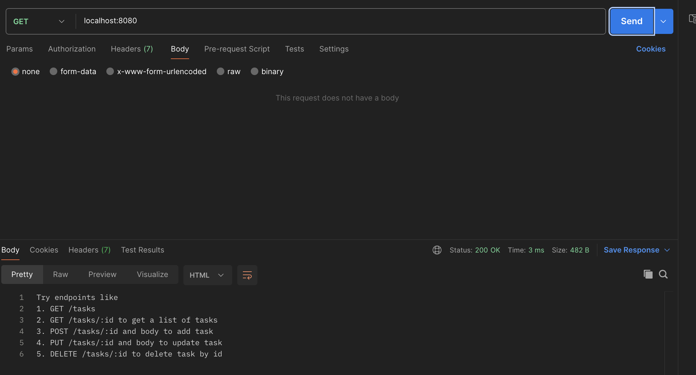
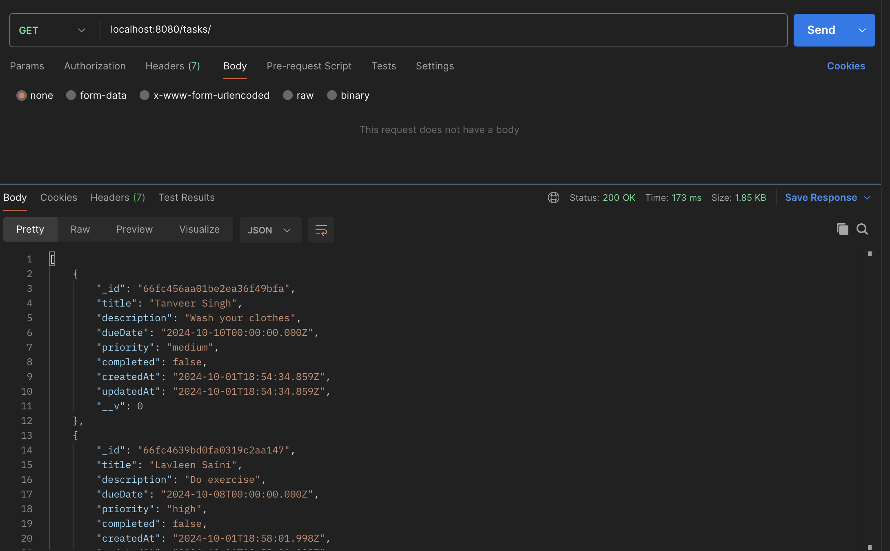
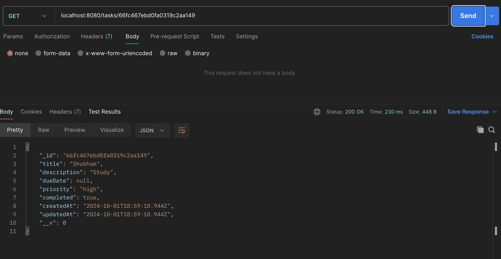
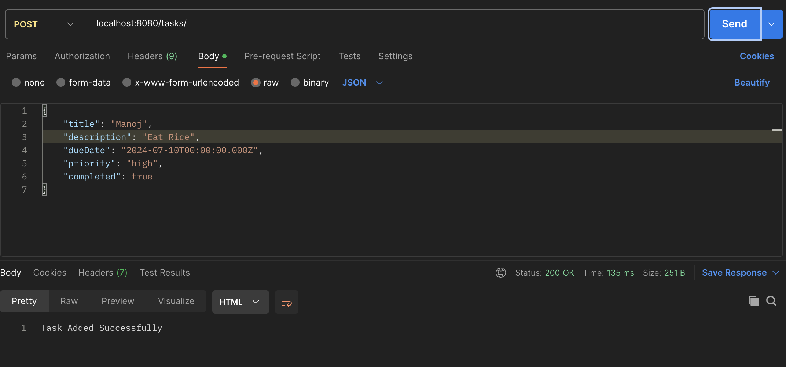
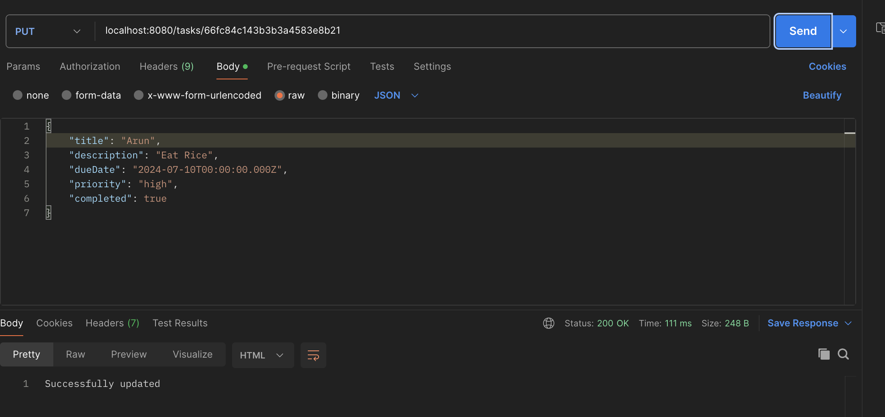
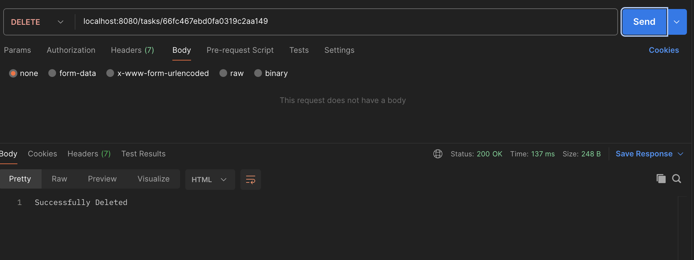

# Task Manager Instruction

## Installation

- npm install

## Usage

- Create a .env file in the root directory and add your MongoDB connection string
- Inside .env file put =>  
  MONGODB_URL: Connection string for your MongoDB database.  
  PORT: The port on which the server will run (default: 8080).
- Start Server using node server.js
- Server will be runinng at 8080

## Endpoints

- GET / -> Returns a list of available endpoints.
- GET /tasks -> Retrieves all tasks.
- GET /tasks/:id -> Retrieves a task by ID.
- POST /tasks -> Creates a new task. Requires a JSON body with title, description, dueDate, priority, and optional completed.
- PUT /tasks/:id -> Updates an existing task by ID. Requires a JSON body with fields you wish to update.
- DELETE /tasks/:id -> Deletes a task by ID.

## Using Endpoints

- GET /:  
  
- GET /tasks:  
  
- GET /tasks/:id  
  
- POST /tasks ->  
  
- PUT /tasks/:id  
  
- DELETE /tasks/:id  
  
